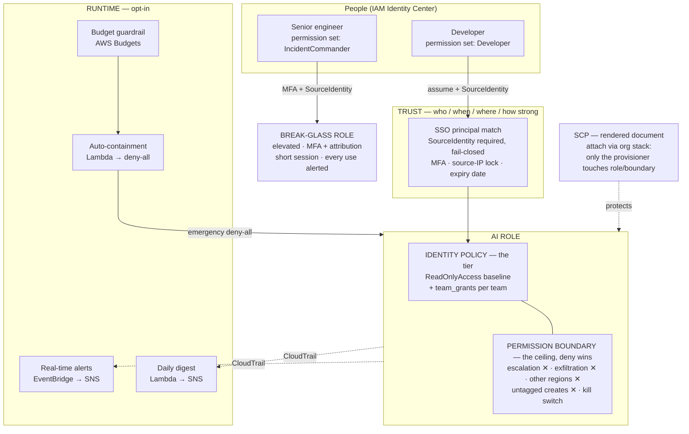
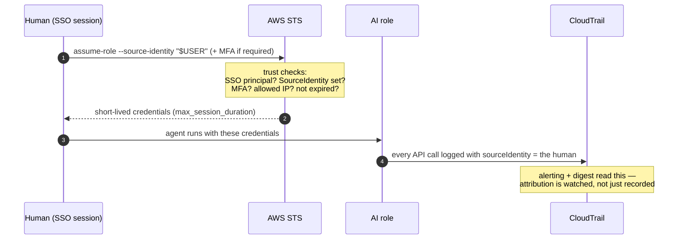
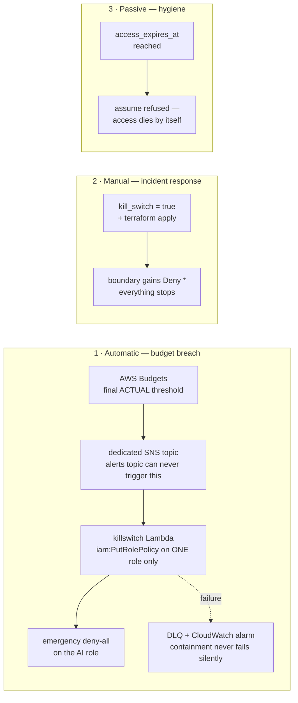

# agent-warden

**The warden lets the agent work — watched, capped, attributable, and killable.**

Internal Terraform module that provisions governed AWS access for an autonomous
AI agent (e.g. Claude Code) on a **shared account**. It solves the two problems
that make shared-account AI access dangerous:

- **Attribution** — *"who told the AI to do that?"* Every session is bound to a
  named human, fail-closed, visible in CloudTrail.
- **Blast radius** — *"how far could it get?"* A permission boundary no grant can
  pierce, plus an optional runtime layer that watches, alerts, and contains.

Provisioned centrally (Terraform Cloud workspace), never per developer. Widening
access is a reviewed merge request, not a console click.

---

## Contents

- [When to use it](#when-to-use-it)
- [Architecture](#architecture)
- [How access works](#how-access-works)
- [Containment paths](#containment-paths)
- [Quick start](#quick-start)
- [Configuration recipes](#configuration-recipes)
- [Operations runbook](#operations-runbook)
- [Requirements & prerequisites](#requirements--prerequisites)
- [Inputs](#inputs)
- [Outputs](#outputs)
- [Running costs](#running-costs)
- [Testing & CI](#testing--ci)
- [Sharp edges & known limits](#sharp-edges--known-limits)
- [Design decisions](#design-decisions)
- [Out of scope](#out-of-scope)

---

## When to use it

**Use it when:** multiple teams share an AWS account, identities come from IAM
Identity Center (SSO), provisioning runs through Terraform Cloud, and an AI
agent needs read access with controlled, team-scoped extensions.

**Skip it when:** a single developer works in their own sandbox account — a
plain role with `ReadOnlyAccess` is enough there; this module's value is
governance, and governance of one person is overhead.

---

## Architecture

Three orthogonal layers own three different questions, plus an opt-in runtime
layer on top. No layer can undo another's decision — the boundary's denies win
over any grant, always.



| Layer | Question it owns | Changed by |
|---|---|---|
| Trust | who may become this identity, under what conditions | platform team |
| Boundary | what is impossible, no matter what | platform/security team |
| Identity policy | what this team's agent may do | team MR, reviewed |
| Runtime | who is told, and what happens automatically | platform team |

---

## How access works

No long-lived keys exist anywhere. The agent gets short-lived credentials via
`credential_process`, and the human's identity travels with every API call.



Point the agent at the role with the module's `credential_process` output — a
drop-in `~/.aws/config` profile that mints attributed JIT credentials on demand.
With `require_source_identity = true` (the default), an unattributed assume is
**refused by AWS**, not merely discouraged.

---

## Containment paths

Three independent ways to stop the agent, fastest first:



- The **forecast threshold** alerts before money is spent but never contains —
  a prediction is not grounds for automatic action.
- The **emergency deny-all is out-of-band from Terraform**: a plain apply does
  NOT remove it (see [runbook](#operations-runbook) for stand-down).

---

## Quick start

### The pattern: one instance per team

Grants pooled on a single role leak across teams at runtime — any human who can
assume gets every team's grants. Separate instances make permissions, budget,
alerts, digest, and kill switch **per-team automatically**:

```hcl
module "warden_platform" {
  source = "path/to/modules/agent-warden"

  name                     = "claude-agent-platform"
  sso_permission_set_names = ["PlatformEngineer"]
  allowed_regions          = ["us-east-1"]

  team_grants = [
    {
      sid       = "SandboxWrite"
      actions   = ["s3:PutObject"]
      resources = ["arn:aws:s3:::plat-sandbox/*"]
    },
  ]

  enable_budget_guardrail = true
  monthly_budget_usd      = 300
  budget_cost_tag         = { key = "Purpose", value = "ai-agent-platform" }
}

module "warden_data" {
  source = "path/to/modules/agent-warden"

  name                     = "claude-agent-data"
  sso_permission_set_names = ["DataEngineer"]
  allowed_regions          = ["us-east-1"]
}
```

### Minimal (single team / evaluation)

```hcl
module "warden" {
  source = "path/to/modules/agent-warden"

  name                     = "claude-agent"
  sso_permission_set_names = ["Developer"]
  allowed_regions          = ["us-east-1"]
}
```

### Onboard the agent

```
terraform output -raw credential_process   # → paste into ~/.aws/config
```

The rendered profile calls `aws sts assume-role` with `--source-identity "$USER"`
on demand — short-lived, attributed, nothing stored.

---

## Configuration recipes

### Hardened trust

```hcl
require_source_identity = true                   # default — fail-closed attribution
require_mfa             = true                   # SSO session must have used MFA
allowed_source_ip_cidrs = ["203.0.113.0/24"]     # TFC runners / corp VPN only
access_expires_at       = "2026-12-31T23:59:59Z" # access dies by itself
max_session_duration    = 3600
```

### Let one team read one secret (without dropping the exfil guard)

A boundary deny beats any grant, so the exception must be carved out of the
deny itself (`NotResource`) *and* granted:

```hcl
data_read_exceptions = [
  "arn:aws:secretsmanager:us-east-1:111122223333:secret:platform/shared-*",
]

team_grants = [
  {
    sid       = "PlatformReadSharedSecret"
    actions   = ["secretsmanager:GetSecretValue"]
    resources = ["arn:aws:secretsmanager:us-east-1:111122223333:secret:platform/shared-*"]
  },
]
```

> If the secret is encrypted with a customer-managed KMS key, add the key ARN
> to `data_read_exceptions` too — `kms:Decrypt` stays denied everywhere else.

### Full runtime

```hcl
enable_alerting = true
alert_emails    = ["secops@example.com"]

enable_daily_digest = true
# scales to busy accounts; omit for the LookupEvents fallback:
# digest_event_data_store_arn = "arn:aws:cloudtrail:us-east-1:111122223333:eventdatastore/..."

enable_budget_guardrail             = true
monthly_budget_usd                  = 500
budget_forecasted_threshold_percent = 100
enable_budget_killswitch            = true
enforce_cost_tag_on_create          = true

enable_break_glass                   = true
break_glass_sso_permission_set_names = ["IncidentCommander"]
```

### The org-level outer wall (SCP)

The boundary is account-local — anyone with `iam:*` in the account could lift
it. Set the provisioner and attach the rendered SCP via the org-management
stack; after that, nobody else can touch the role, its trust, or its boundary
(the killswitch Lambda's role is auto-exempted so containment keeps working):

```hcl
provisioner_principal_arns = ["arn:aws:iam::111122223333:role/tfc-provisioner"]
```

```
terraform output -raw scp_policy_json   # → attach in the org-management stack
```

---

## Operations runbook

### Contain the agent NOW (incident)

1. Set `kill_switch = true`, apply via the TFC workspace. The boundary gains
   `Deny *` — every action stops, including in-flight sessions.
2. Investigate via CloudTrail: filter by the role, group by `sourceIdentity`.

### Stand down after a budget-breach auto-containment

The Lambda's emergency policy is out-of-band — **apply does not remove it**:

1. Decide: raise `monthly_budget_usd`, or keep containment via `kill_switch = true`.
2. Remove the emergency policy explicitly:
   `aws iam delete-role-policy --role-name <role> --policy-name ZZZ-EMERGENCY-DENY-ALL`
3. Optional: `exclusive_inline_policies = true` makes Terraform reconcile such
   drift — but then a routine apply after a breach *lifts containment*. Gate
   applies during incidents if you enable it.

### Use break-glass

1. Assume `<name>-breakglass` with MFA and `--source-identity "$USER"` — both
   are enforced, not optional.
2. Every assumption pages the alerts topic (when alerting is on). Expect the
   question "why?" — that is the point.
3. Session dies at `break_glass_max_session_duration`. Do the emergency work,
   then codify the fix through a normal MR.

### Onboard a new team

1. New module instance: `name = "claude-agent-<team>"`, the team's permission
   set, their budget + cost tag. One MR.
2. Team runs `terraform output -raw credential_process` → `~/.aws/config`.
3. Extensions later = `team_grants` entries in that instance only.

### Renew / expire access

`access_expires_at` reached → assume is refused; nothing to clean up. Renewal
is a one-line MR moving the date — which is exactly the review checkpoint you
want.

---

## Requirements & prerequisites

| Requirement | Version / detail |
|---|---|
| Terraform | `>= 1.9.0` (suite tested on 1.9.8 and current) |
| AWS provider | `>= 5.75.0, < 6.0.0` (5.75 for `aws_iam_role_policies_exclusive`) |
| Archive provider | `>= 2.4.0` (zips the Lambda sources at plan time, local only) |
| IAM Identity Center | identities come from SSO permission sets |
| CloudTrail | management-events trail **on** — alerting and digest read it (module does not create one) |
| Cost-allocation tag | `budget_cost_tag.key` activated in Billing, or the guardrail sees no spend |
| TFC workspace | central provisioning; its role ARN feeds `provisioner_principal_arns` |

---

## Inputs

### General

| Name | Description | Type | Default |
|---|---|---|---|
| `create` | Master switch. When false the module creates nothing. | `bool` | `true` |
| `name` | Name of the AI agent role (and prefix for its policies). | `string` | `"ai-agent"` |
| `tags` | Tags applied to all resources. | `map(string)` | `{}` |

### Trust — who may assume

| Name | Description | Type | Default |
|---|---|---|---|
| `sso_permission_set_names` | Identity Center permission-set names whose users may assume the AI role. **Required.** | `list(string)` | — |
| `require_source_identity` | Refuse assume without `sts:SourceIdentity` (the human) — fail-closed attribution. | `bool` | `true` |
| `require_mfa` | Require MFA in the originating SSO session. | `bool` | `false` |
| `allowed_source_ip_cidrs` | Assume only from these CIDRs (TFC / VPN egress). Empty = any IP. | `list(string)` | `[]` |
| `access_expires_at` | RFC3339 instant after which the role can no longer be assumed. Empty = no expiry. | `string` | `""` |
| `max_session_duration` | Max session seconds (900–43200). Keep short — the agent re-assumes. | `number` | `3600` |

### Guardrails — the boundary

| Name | Description | Type | Default |
|---|---|---|---|
| `allowed_regions` | Actions outside these regions are denied (global services exempt). | `list(string)` | `["us-east-1"]` |
| `deny_data_exfiltration` | Deny value-reads: secrets, SSM params, KMS decrypt, S3 objects, DynamoDB + Data APIs, queues/streams, query/log contents, and credential-minting "reads". | `bool` | `true` |
| `data_read_exceptions` | Resource ARNs the exfiltration deny skips (`NotResource`). Pair with a team grant. | `list(string)` | `[]` |
| `extra_denied_actions` | Additional hard denies. | `list(string)` | `[]` |
| `enforce_cost_tag_on_create` | Deny listed create actions unless the request carries `budget_cost_tag.key`. | `bool` | `false` |
| `cost_tag_enforced_actions` | Create actions the tag-on-create deny covers (only services documenting `aws:RequestTag`). | `list(string)` | curated EC2/RDS/ECS/EKS/ELB list |
| `kill_switch` | Deny **all** actions instantly (incident response). | `bool` | `false` |
| `exclusive_inline_policies` | Terraform removes inline policies it doesn't manage — drift **and** the emergency deny-all (see runbook trade-off). | `bool` | `false` |
| `provisioner_principal_arns` | Principals allowed to manage role/boundary; feeds `scp_policy_json`. Empty = no SCP rendered. | `list(string)` | `[]` |

### Permissions — the tier

| Name | Description | Type | Default |
|---|---|---|---|
| `attach_read_only` | Attach AWS-managed `ReadOnlyAccess` as the baseline. | `bool` | `true` |
| `team_grants` | Per-team allow statements layered on the baseline, always capped by the boundary. Shape below. | `list(object)` | `[]` |

```hcl
team_grants = [{
  sid       = string                 # unique per grant
  actions   = list(string)
  resources = optional(list(string), ["*"])
  conditions = optional(list(object({
    test     = string                # e.g. "StringEquals"
    variable = string                # e.g. "aws:RequestedRegion"
    values   = list(string)
  })), [])
}]
```

### Notifications

| Name | Description | Type | Default |
|---|---|---|---|
| `alert_sns_topic_arn` | Bring-your-own topic for all notifications. Empty = module creates one on demand. | `string` | `""` |
| `alert_emails` | Emails subscribed to the module-created topic (each must confirm). | `list(string)` | `[]` |
| `alerts_kms_key_id` | CMK for the module-created topics. Must grant events/budgets publish; empty = no SSE. | `string` | `""` |
| `lambda_log_retention_days` | Retention for the killswitch/digest Lambda log groups. | `number` | `30` |

### Active attribution

| Name | Description | Type | Default |
|---|---|---|---|
| `enable_alerting` | Real-time SNS alert on high-risk AI actions and every break-glass assumption. | `bool` | `false` |
| `high_risk_event_names` | CloudTrail event names that trigger the real-time alert. | `list(string)` | curated list (instance/user/key/policy/secret writes) |
| `enable_daily_digest` | Scheduled Lambda summarising the last 24h (who / what / how often) to SNS. | `bool` | `false` |
| `digest_schedule` | EventBridge schedule expression (UTC). | `string` | `"cron(0 13 * * ? *)"` |
| `digest_event_data_store_arn` | BYO CloudTrail Lake store — server-side SQL that scales; empty = LookupEvents fallback (flags truncation honestly). | `string` | `""` |

### FinOps guardrail

| Name | Description | Type | Default |
|---|---|---|---|
| `enable_budget_guardrail` | Track AI-attributed spend against a monthly budget. | `bool` | `false` |
| `monthly_budget_usd` | Monthly USD budget. Must be > 0 when the guardrail is on. | `number` | `0` |
| `budget_cost_tag` | Cost-allocation `{key, value}` attributing spend to the AI. | `object({key, value})` | `{ key = "Purpose", value = "ai-agent" }` |
| `budget_alert_thresholds_percent` | ACTUAL-spend thresholds that alert. | `list(number)` | `[80, 100]` |
| `budget_forecasted_threshold_percent` | FORECASTED threshold — alerts early, never contains. 0 = off. | `number` | `100` |
| `enable_budget_killswitch` | Final-threshold breach → Lambda attaches emergency deny-all. Requires the guardrail. | `bool` | `false` |

### Break-glass

| Name | Description | Type | Default |
|---|---|---|---|
| `enable_break_glass` | Separate elevated role — always MFA + SourceIdentity, short-lived, alerted. | `bool` | `false` |
| `break_glass_sso_permission_set_names` | Narrower senior group allowed to assume it. Empty = reuse the AI's. | `list(string)` | `[]` |
| `break_glass_policy_arns` | Managed policies attached to it. | `list(string)` | `["arn:aws:iam::aws:policy/PowerUserAccess"]` |
| `break_glass_max_session_duration` | Session seconds (900–43200). Keep short. | `number` | `3600` |

> All 39 variables are `nullable = false` — an explicit `null` fails fast with
> a clear message instead of crashing an interpolation somewhere downstream.

---

## Outputs

| Name | Description |
|---|---|
| `role_arn` | ARN of the AI agent role — what the agent assumes. |
| `role_name` | Name of the AI agent role. |
| `permission_boundary_arn` | ARN of the boundary policy (the ceiling). |
| `kill_switch_engaged` | True while the kill switch denies everything. |
| `access_expires_at` | When the identity self-expires (empty = never). |
| `break_glass_role_arn` | Break-glass role ARN (null unless enabled). |
| `alert_topic_arn` | SNS topic carrying alerts / budget / digest (null when no notification feature is on). |
| `credential_process` | Drop-in `~/.aws/config` profile minting short-lived, attributed creds on demand. |
| `boundary_policy_json` | Rendered boundary document — available even with `create = false`, for review and offline lint. |
| `trust_policy_json` | Rendered trust (assume-role) document. |
| `team_grants_policy_json` | Rendered team-grants document (null when no grants). |
| `scp_policy_json` | Rendered org-level SCP protecting the guardrails (null until `provisioner_principal_arns` is set). |

---

## Running costs

The governance layer is designed to cost ~nothing (us-east-1; verify current pricing):

| Configuration | Monthly cost |
|---|---|
| Identity core only | **$0.00** — IAM is free |
| Full runtime enabled | **~$0.10–0.75** — one alarm ($0.10); the budget (free within the first 2 per account, else ~$0.60); Lambda/SNS/SQS/logs are pennies |

External, not billed by the module: the CloudTrail trail (usually already
present; the first copy of management events is free), optional CloudTrail
Lake (~$0.75/GB ingested — the only potentially material line, BYO), optional
KMS CMK ($1/month). The agent's own API calls are free — spend comes from what
it *creates*, which is exactly what the guardrail caps.

---

## Testing & CI

- **30 plan-level tests** (`terraform test`, mocked provider) covering trust
  conditions, boundary denies, exceptions, grant-condition shape, every runtime
  feature's resource graph, and negative validation cases. The suite passes on
  both edges of the supported range (1.9.8 and current).
- **Offline policy lint**: `tests/render/` renders the four policy documents
  with `create = false` and **zero credentials**; `tests/lint_policies.py` runs
  them through parliament (an IAM policy linter). This gate catches malformed
  condition operators, unknown action prefixes, and escalation paths that
  `terraform validate` structurally cannot — it has already caught real bugs.
- **`.gitlab-ci.yml`** ships with the module (standalone-repo layout):
  `verify → test → audit` as a parallel DAG — fmt, validate + the test suite on
  both Terraform versions (JUnit into the GitLab test UI), secret scan, Lambda
  byte-compile, policy render artifact → parliament lint. The pipeline is fully
  offline: **no AWS credentials exist in CI**.
- The one thing CI cannot prove — a live `assume + apply` — is a deliberate,
  human-gated acceptance step in a sandbox account.

---

## Sharp edges & known limits

- **CloudTrail must be on.** Alerting (EventBridge) and the digest both read
  management events; the module does not create a trail.
- **SNS encryption**: module-created topics have no SSE by default — the
  AWS-managed `alias/aws/sns` key cannot grant events/budgets publish and would
  silently break delivery. Pass a properly-scoped CMK via `alerts_kms_key_id`
  if you need encryption at rest.
- **BYO topic** (`alert_sns_topic_arn`): you own its access policy — grant
  `events.amazonaws.com` and `budgets.amazonaws.com` `sns:Publish` yourself.
- **The boundary guards escalation/exfil/region — not destruction.**
  Read-only-ness comes from the tier; a team grant you write can permit
  destructive writes. Grant narrowly; `high_risk_event_names` alerting watches
  what you open.
- **CMK-encrypted data needs the key in `data_read_exceptions` too** —
  `kms:Decrypt` stays denied everywhere else.
- **The emergency deny-all survives `terraform apply`** — stand down explicitly
  (see runbook).
- **Break-glass assume alerts are regional**: global-endpoint STS calls land in
  us-east-1's event bus. Deploy alerting there, or use regional STS endpoints.
- **Budgets data lags ~8–24h** — the killswitch is runaway-spend containment,
  not a real-time circuit breaker; a fast burst can overshoot before
  containment lands (the forecast threshold exists to warn earlier).
- **Digest LookupEvents fallback** is throttled (~2 req/s, no server-side role
  filter); on busy accounts it reports itself truncated — provide a CloudTrail
  Lake store for complete digests.

---

## Design decisions

- **Deny-wins layering.** Guarantees live in the boundary, permissions in the
  tier. A reviewer reads the boundary once; team grants can never weaken it.
- **Reference, don't create.** SSO, CloudTrail, KMS, and the org SCP attachment
  are referenced or rendered — resources owned by other stacks stay there. The
  SCP is an *output document*, not a resource, because org management is not
  this module's jurisdiction.
- **Out-of-band containment, on purpose.** Incident response can't wait for
  plan/apply; the killswitch Lambda acts directly, and the drift story is
  documented rather than hidden (`exclusive_inline_policies` reconciles it,
  with its trade-off stated).
- **Policies are `jsonencode()`d locals**, not policy-document data sources —
  which is what makes plan-time assertions and the credential-free render/lint
  pipeline possible.
- **Everything costly or opinionated is opt-in.** The identity core stands
  alone; runtime features default off.
- **Break-glass has no expiry** — an emergency role that can lock you out
  mid-incident is worse than none.

## Out of scope

- **Break-glass approval flow** — assumption is alerted but not gated; a
  two-person or ticket-gated flow belongs in the Identity Center permission-set
  assignment process, not here.
- **Per-human spend attribution** — actions attribute to people, dollars only
  to the role's cost tag (an AWS billing limitation).
- **The live sandbox apply** — the final acceptance gate, run by a human with
  real SSO principals before the first team onboards.
