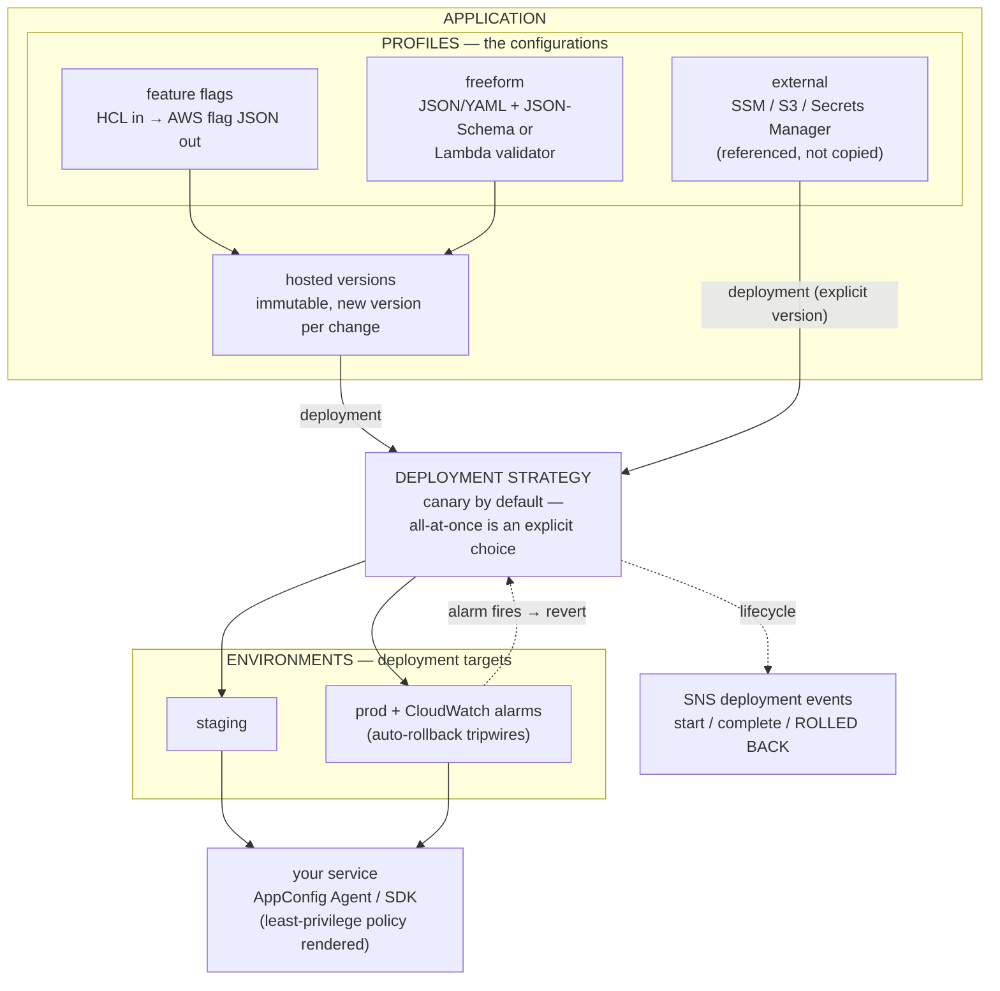
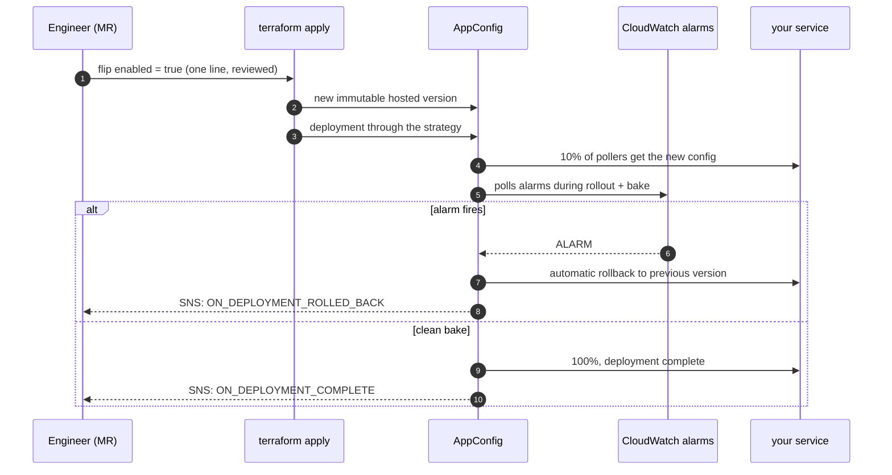

# appconfig

**Config ships like code — through a canary, watched by alarms, rolled back
automatically. Never like an edit.**

Internal Terraform module for AWS AppConfig: feature flags and runtime
configuration with progressive delivery. It exists to kill two failure modes:

- **The config edit that took prod down** — here every change deploys through a
  strategy (canary by default), CloudWatch alarms watch the rollout *and* the
  bake window, and AppConfig reverts on its own the moment one fires.
- **Hand-written flag JSON** — feature flags are declared in plain HCL; the
  module renders the arcane `AWS.AppConfig.FeatureFlags` document (constraints,
  type-correct values) so nobody ever writes or reviews raw flag JSON again.

---

## Contents

- [Architecture](#architecture)
- [The release flow](#the-release-flow)
- [Quick start](#quick-start)
- [Configuration recipes](#configuration-recipes)
- [Consuming the config](#consuming-the-config)
- [Requirements](#requirements)
- [Inputs](#inputs)
- [Outputs](#outputs)
- [Running costs](#running-costs)
- [Testing](#testing)
- [Sharp edges & known limits](#sharp-edges--known-limits)
- [Design decisions](#design-decisions)

---

## Architecture



## The release flow

`terraform apply` **is** the config release — a flag flip becomes a canary, not
an edit:



---

## Quick start

```hcl
module "appconfig" {
  source = "path/to/modules/appconfig"

  name = "checkout"

  environments = {
    staging = {}
    prod    = { alarm_arns = [aws_cloudwatch_metric_alarm.api_5xx.arn] }
  }

  profiles = {
    flags = {
      type = "feature-flags"
      flags = {
        checkout-v2 = {
          enabled = false # flip + apply = canary rollout with auto-rollback
          attributes = {
            rollout-percent = { type = "number", value = "10", minimum = 0, maximum = 100 }
          }
        }
      }
    }
  }

  deployments = [
    { environment = "prod", profile = "flags" }, # default strategy = canary
  ]
}
```

Flipping `enabled` and applying produces: a new immutable version → a canary
deployment → alarm-watched bake → automatic rollback if prod complains. The
rendered flag document is an output (`feature_flags_json`) — reviewers diff
exactly what ships.

---

## Configuration recipes

### Typed feature flags

Attribute values are passed as strings and **cast by their declared type** at
render (Terraform cannot type a map of mixed number/bool/string values — the
module absorbs that wall so your HCL stays clean):

```hcl
flags = {
  checkout-v2 = {
    description = "new checkout flow"
    enabled     = false
    attributes = {
      rollout-percent = { type = "number", value = "10", required = true, minimum = 0, maximum = 100 }
      allowed-tier    = { type = "string", value = "beta", enum = ["beta", "gold", "all"] }
      sticky-sessions = { type = "boolean", value = "true" }
    }
  }
}
```

Validations reject uncastable values, required-but-empty attributes, and bad
flag names at plan time — before AWS ever sees them.

### Env-specific flag values (`per_environment`)

Constraints stay global — one schema, different values. Any override fans the
profile out into one generated AppConfig profile per environment declared in
the state (`flags-staging`, `flags-prod`); deployments resolve to the right
instance automatically:

```hcl
flags = {
  checkout-v2 = {
    enabled = false # base
    attributes = {
      rollout-percent = { type = "number", value = "10" }
    }
    per_environment = {
      staging = { enabled = true }                              # staging runs ahead
      prod    = { attributes = { rollout-percent = "50" } }     # values only, same schema
    }
  }
}
```

### Topology: all envs in one state vs tfvars-per-env

Both work; pick by how you provision:

- **One state, many environments** — declare `staging` + `prod` in one module
  call, use `per_environment`, promote by deploying the same profile through
  increasingly careful strategies. Natural when envs share an account.
- **tfvars-per-env workspaces** (`dev.tfvars` / `stage.tfvars` / `prod.tfvars`,
  one apply each) — declare only that workspace's environment; keep ONE shared
  flags definition in code with all envs' `per_environment` values inline.
  **Override keys for environments not declared in the workspace are ignored
  by design** — the dev workspace renders dev values, prod renders prod, same
  code, no duplication. Across AWS accounts this is the only option anyway
  (an AppConfig application cannot span accounts).

```hcl
# shared code
environments = { (var.environment_name) = { alarm_arns = var.rollback_alarm_arns } }
deployments  = [{ environment = var.environment_name, profile = "flags" }]

# prod.tfvars
environment_name    = "prod"
rollback_alarm_arns = ["arn:aws:cloudwatch:...:alarm:api-5xx"]
```

### Freeform config with a schema gate

```hcl
profiles = {
  tuning = {
    content     = jsonencode({ timeout_ms = 250, max_retries = 3 })
    json_schema = jsonencode({
      type     = "object"
      required = ["timeout_ms", "max_retries"]
      properties = {
        timeout_ms = { type = "number", minimum = 1, maximum = 5000 }
      }
    })
  }
}
```

The validator runs inside AppConfig on every version create *and* deployment
start — malformed config physically cannot ship. A `lambda_validator_arn` does
the same with arbitrary logic.

### External sources (reference, don't copy)

```hcl
profiles = {
  params = {
    location_uri       = "ssm-parameter://prod/checkout/config"
    retrieval_role_arn = aws_iam_role.appconfig_retrieval.arn
  }
}
```

Deployments of external profiles need an explicit `configuration_version`.

### Custom rollout shapes

```hcl
deployment_strategies = {
  prod-careful = {
    deployment_duration_minutes = 30
    growth_factor               = 10   # +10% of pollers per step
    bake_time_minutes           = 15   # alarms keep watching after 100%
  }
}

deployments = [
  { environment = "prod", profile = "flags", strategy = "prod-careful" },
  { environment = "staging", profile = "flags", strategy = "AppConfig.AllAtOnce" },
]
```

AWS presets (`AppConfig.AllAtOnce`, `AppConfig.Linear50PercentEvery30Seconds`,
`AppConfig.Canary10Percent20Minutes`) are referenced by literal id — no
resources needed. The module default is the **canary** preset: slow is the
default, fast is a choice.

---

## Consuming the config

- `retrieval_policy_json` — least-privilege IAM policy (session-based
  retrieval, scoped to exactly this application's environments × profiles).
  Attach it to the service's task/instance role.
- `fetch_example` — the raw session API calls for a quick check. In production
  use the AppConfig Agent (ECS/EKS sidecar) or the Lambda extension — they
  cache, poll, and re-fetch on deployment automatically.

---

## Requirements

| Requirement | Version / detail |
|---|---|
| Terraform | `>= 1.9.0` |
| AWS provider | `>= 5.40.0, < 6.0.0` |
| CloudWatch alarms | bring your own ARNs for auto-rollback (the module wires the monitor role) |

---

## Inputs

### General

| Name | Description | Type | Default |
|---|---|---|---|
| `create` | Master switch. When false the module creates nothing (rendered outputs still work). | `bool` | `true` |
| `name` | Application name (and prefix for module-created IAM/SNS). **Required.** | `string` | — |
| `description` | Application description. | `string` | `""` |
| `tags` | Tags applied to all resources. | `map(string)` | `{}` |

### Environments

| Name | Description | Type | Default |
|---|---|---|---|
| `environments` | Map of environments; `alarm_arns` (≤5) arm automatic rollback. | `map(object)` | `{}` |
| `monitor_role_arn` | BYO role AppConfig assumes to read alarms. Empty = created automatically when any env has alarms. | `string` | `""` |

### Profiles

| Name | Description | Type | Default |
|---|---|---|---|
| `profiles` | Map of configuration profiles — typed feature flags or freeform (hosted or external). Full shape below. | `map(object)` | `{}` |

```hcl
profiles = {
  <name> = {
    type         = "freeform" | "feature-flags"   # default "freeform"
    description  = optional(string)
    location_uri = optional(string, "hosted")      # or ssm-parameter:// / s3:// / secretsmanager://

    # hosted freeform
    content      = optional(string)                # jsonencode()/yamlencode() it yourself
    content_type = optional(string, "application/json")

    # external sources
    retrieval_role_arn = optional(string)

    # freeform validators
    json_schema          = optional(string)
    lambda_validator_arn = optional(string)

    # feature flags
    flags = optional(map(object({
      description = optional(string)
      enabled     = bool
      attributes = optional(map(object({
        type     = string                          # string | number | boolean
        value    = optional(string)                # cast by type at render
        required = optional(bool, false)
        enum     = optional(list(string))
        pattern  = optional(string)
        minimum  = optional(number)
        maximum  = optional(number)
      })))
      # env-specific values; foreign env keys ignored (tfvars-per-env friendly)
      per_environment = optional(map(object({
        enabled    = optional(bool)                # null = inherit
        attributes = optional(map(string))         # attr => value override
      })))
    })))

    kms_key_arn = optional(string)
    tags        = optional(map(string))
  }
}
```

### Strategies & deployments

| Name | Description | Type | Default |
|---|---|---|---|
| `deployment_strategies` | Custom rollout shapes (duration, growth, bake, replicate_to). Keys must not shadow `AppConfig.*`. | `map(object)` | `{}` |
| `default_deployment_strategy` | Used when a deployment names none. | `string` | `"AppConfig.Canary10Percent20Minutes"` |
| `deployments` | Managed deployments: `{environment, profile, strategy?, configuration_version?, description?}`. Unique per env+profile; content changes redeploy on apply. | `list(object)` | `[]` |

### Notifications

| Name | Description | Type | Default |
|---|---|---|---|
| `enable_notifications` | Deployment lifecycle events → SNS via an AppConfig extension. | `bool` | `false` |
| `notification_points` | Which lifecycle points notify. | `list(string)` | start / complete / rolled-back |
| `alert_sns_topic_arn` | BYO topic. Empty = module creates one. | `string` | `""` |
| `alert_emails` | Emails subscribed to the module-created topic. | `list(string)` | `[]` |

> All variables are `nullable = false`; every validation is null-safe on
> Terraform 1.9+ (lazy ternaries, no eager `||` dereferences).

---

## Outputs

| Name | Description |
|---|---|
| `application_id` / `application_arn` | The AppConfig application. |
| `environment_ids` | Map env key → id. |
| `profile_ids` | Map profile key → id. |
| `hosted_version_numbers` | Map profile key → current hosted version. |
| `deployment_strategy_ids` | Map custom strategy key → id. |
| `deployment_numbers` | Map `env:profile` → latest managed deployment number. |
| `monitor_role_arn` | Role AppConfig reads rollback alarms with. |
| `events_topic_arn` | SNS topic for lifecycle events (null when off). |
| `feature_flags_json` | **Rendered flag documents — work even with `create = false`**; diff in MRs, lint in CI, no credentials needed. |
| `retrieval_policy_json` | Least-privilege consumer policy scoped to this app's env×profile pairs. |
| `fetch_example` | Session-API fetch snippet for a smoke check. |

---

## Running costs

AppConfig bills per configuration request (~$0.0000002/request beyond the free
tier) — a typical service polling via the agent costs cents per month. The
module's own resources (application, profiles, strategies, IAM, extension) are
free; the SNS topic is pennies. There is no per-flag or per-seat cost — which
is the economic argument versus a feature-flag SaaS.

## Testing

- `terraform test` runs **30 plan-level checks** against a mocked provider:
  the flag renderer's exact output (type casts, constraints, format markers),
  the `per_environment` fan-out and resolution, freeform passthrough, external
  profiles, monitor-role logic, strategies, deployments, notifications wiring,
  `create = false` rendering, and 15 negative validation cases. Hosted content
  is a pure function of variables, so the exact bytes that ship are asserted
  offline.
- **Offline flag lint in CI**: `tests/render/` renders the documents with zero
  credentials; `tests/lint_flags.py` checks the AWS format plus the semantic
  rules terraform can't express (enum membership, numeric bounds, regex
  patterns, required coverage).
- **The rollback drill** (`examples/appconfig/drill.sh`): a turnkey script for
  the sandbox - starts a deployment, forces the guard alarm with
  `set-alarm-state`, and polls until AppConfig reverts it. Zero cost. Run it
  once before the first team relies on auto-rollback: an untested rollback is
  a rumor, not a control.

## Sharp edges & known limits

- **One in-flight deployment per environment** (AWS limit). Two managed
  deployments targeting the same environment conflict if both re-deploy in one
  apply — keep one per environment, or stagger applies.
- **Deployments don't wait for bake.** Apply returns when the deployment
  starts; rollout and rollback continue inside AppConfig. Watch the SNS events
  (or the console) for the outcome — that's why notifications exist.
- **A content change replaces the hosted version resource.** Old versions stay
  in AppConfig's history (`create_before_destroy`), so rollback targets always
  exist.
- **Feature-flag attribute values are strings in HCL** — deliberate: Terraform
  cannot type mixed-value maps. Declared `type` casts them; validations reject
  anything uncastable at plan time.
- **`retrieval_policy_json` / `fetch_example` are known after apply** (they
  embed generated ids). Only `feature_flags_json` renders offline.
- **Validators can't protect external sources** the way they protect hosted
  content — SSM/S3 content is read at deployment time; validation still runs
  at deployment start, not at source-write time.

## Design decisions

- **Canary is the default strategy.** All-at-once must be spelled out. Safe is
  the default, fast is a choice — same philosophy as the rest of this repo.
- **Flags as typed HCL, rendered once, asserted byte-for-byte in tests.** The
  AWS flag format is an implementation detail nobody should hand-maintain.
- **Reference, don't create**: alarms, KMS keys, external config sources and
  retrieval roles are inputs; the module only creates what it owns.
- **Rendered artifacts as outputs** (`feature_flags_json` with `create=false`)
  — same reviewable-document pattern as agent-warden's policy outputs.
- **Everything costly or opinionated is opt-in**: notifications off by
  default, no strategies created unless declared, monitor role only when
  alarms exist.
