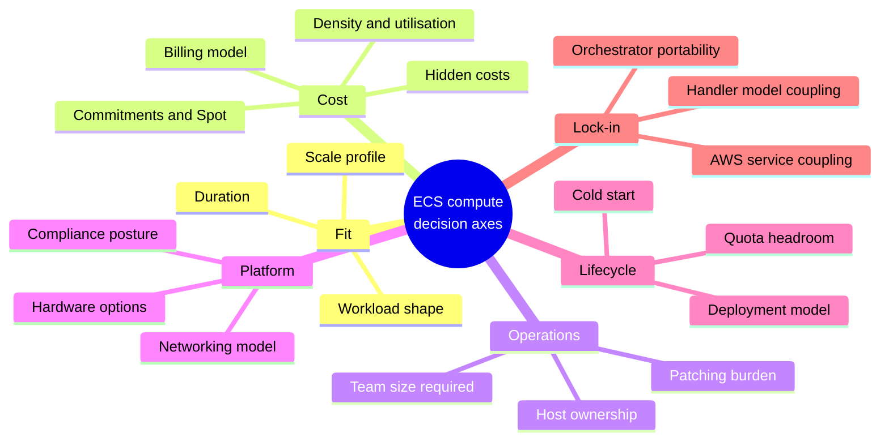
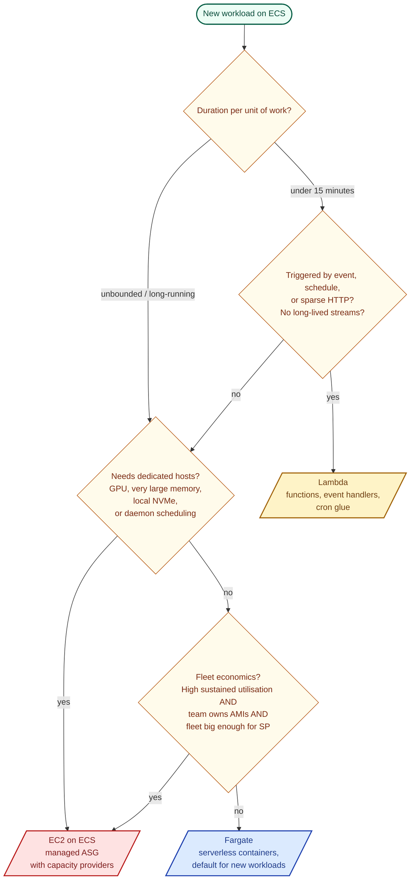

# ECS Compute Selection Guide: Fargate, EC2, Lambda on EU regions

Pick Fargate, EC2 managed instances, or Lambda for container workloads on
AWS ECS. Regions in scope: **eu-west-1**, **eu-west-2**, **eu-central-1**
(all pricing is EU-scoped). Mindmap and decision flow near the end.

## TL;DR

**Default**: Fargate.

**EC2** when any of: sustained host utilisation >50%, GPU / >120 GB mem /
local NVMe, daemon services, or >100 tasks and a team that already owns
AMIs.

**Lambda** when all of: event-driven or scheduled, sparse or <15 min,
no long-lived streams.

**Region**: eu-west-1 by default (cheapest, deepest Spot pool). eu-west-2
only for UK residency, eu-central-1 only for German sovereignty.

**Cost anchors** for a 0.5 vCPU / 1 GB task, 24/7, eu-west-1:

| Model                            | $/month      |
| -------------------------------- | ------------ |
| Fargate on-demand x86            | ~19.58       |
| Fargate on-demand ARM64          | ~15.66       |
| Fargate Spot                     | ~5.88        |
| EC2 c6i.large packed 4x, 1-yr SP | ~14 per task |
| Lambda 512 MB at 30% duty        | ~7           |

Mix freely. Capacity providers let Fargate and EC2 coexist on one
cluster. Decision is per-workload, not per-cluster.

---

## Options at a glance

| Dimension            | Fargate                            | EC2                                        | Lambda                                  |
| -------------------- | ---------------------------------- | ------------------------------------------ | --------------------------------------- |
| Host ownership       | AWS (Firecracker microVMs)         | You (EC2 ASG)                              | AWS (Firecracker)                       |
| Billing unit         | vCPU-sec + GB-sec reserved         | instance-hour                              | invocation + GB-ms                      |
| Max duration         | unlimited                          | unlimited                                  | 15 min                                  |
| Max size             | 16 vCPU / 120 GB (discrete combos) | any instance family                        | 10 GB mem, ~6 vCPU (scales with memory) |
| Cold start           | 30-90 s                            | 5-15 s on warm host, minutes if ASG scales | 100 ms - 10 s                           |
| GPU / specialised hw | no                                 | yes                                        | no                                      |
| Daemon mode          | no                                 | yes                                        | no                                      |
| OS patching          | AWS                                | you                                        | AWS                                     |
| Isolation            | microVM per task                   | shared kernel                              | microVM per invocation                  |
| Spot                 | Fargate Spot, ~70% off             | EC2 Spot, variable                         | none                                    |
| ARM64                | yes (1.4+)                         | yes (Graviton)                             | yes                                     |
| FedRAMP High         | yes                                | AMI-dependent                              | yes                                     |
| Lock-in              | medium                             | low                                        | high                                    |

## When each option wins

**Fargate**

- New workloads, small platform team, bursty or unpredictable traffic
- Compliance / multi-tenant isolation matters
- Fleet below ~10 services or under ~50% sustained utilisation
- No hardware constraints, no daemon requirement

**EC2**

- Dense fleets at >50% utilisation, 100+ tasks
- GPU, high-memory (>120 GB), local NVMe, enhanced networking
- Daemon services (log shippers, node agents)
- Team can own AMIs, ASG, CVE rotation, warm pools
- Cost sensitivity high enough that Savings Plans + Spot math matters

**Lambda**

- Event triggers (S3, SQS, EventBridge, API Gateway)
- Sparse traffic: < a few calls/minute average
- Jobs under 15 minutes
- Prototypes, glue code

## Decision dimensions

Top of the list usually decides on its own. Skim down only if the top
few don't answer it.

1. **Workload shape**. Service vs event vs batch vs daemon.
2. **Scale profile**. Steady / bursty / sparse.
3. **Duration**. The 15-min Lambda ceiling is a hard filter.
4. **Hardware needs**. GPU and memory >120 GB force EC2.
5. **Cost sensitivity**. Only material when compute is >15% of AWS spend.
6. **Team operational capacity**. Can they own AMIs, ASG rotation, CVE response?
7. **Deployment cadence**. Many deploys/day pushes toward Fargate.
8. **Isolation / compliance**. Fargate's per-task microVM closes real attack paths.
9. **Networking constraints**. ENI limits bite dense Fargate; VPC endpoints are required at any real scale.
10. **Lock-in tolerance**. EC2 containers are the most portable to EKS or another orchestrator.

## Cost model

> Pricing covers the three EU regions in scope: **eu-west-1** (Ireland),
> **eu-west-2** (London), **eu-central-1** (Frankfurt). Figures are
> on-demand Linux rates rounded for readability. Verify against the AWS
> pricing pages before committing to an estimate.

### Billing mechanics

**Fargate** (Linux, x86, on-demand; $/vCPU-hr and $/GB-hr):

| Region                   | vCPU-hr  | GB-hr    | Ephemeral > 20 GB per GB-hr | Premium vs us-east-1 |
| ------------------------ | -------- | -------- | --------------------------- | -------------------- |
| eu-west-1 (Ireland)      | $0.04456 | $0.00491 | $0.000122                   | +10%                 |
| eu-west-2 (London)       | $0.04576 | $0.00501 | $0.000125                   | +13%                 |
| eu-central-1 (Frankfurt) | $0.04498 | $0.00493 | $0.000123                   | +11%                 |

- **Fargate Spot**: ~70% off the on-demand rates above. Available in all three regions.
- **Graviton (ARM64)**: ~20% cheaper than x86. Same discount applied to Spot.
- Pricing rounded for readability; check AWS pricing page for the full decimal.

A 0.5 vCPU / 1 GB task running 24/7 (720 hrs):

| Region       | Monthly |
| ------------ | ------- |
| eu-west-1    | ~$19.58 |
| eu-west-2    | ~$20.08 |
| eu-central-1 | ~$19.74 |

**EC2** for a `c6i.large` (2 vCPU / 4 GB), on-demand / 1-yr Compute SP / Spot (typical):

| Region       | On-demand/hr | On-demand/mo | 1-yr SP no-upfront/mo | Spot/mo (typical) |
| ------------ | ------------ | ------------ | --------------------- | ----------------- |
| eu-west-1    | $0.0964      | ~$69         | ~$55                  | ~$22-33           |
| eu-west-2    | $0.0992      | ~$71         | ~$57                  | ~$24-35           |
| eu-central-1 | $0.0963      | ~$69         | ~$55                  | ~$22-33           |

Pack four 0.5-vCPU / 1-GB task-equivalents onto a `c6i.large` with SP: ~$14-17
per task/month. **Roughly 15-25% cheaper than Fargate on-demand once you
can pack the host.** Spot widens the gap further but adds interruption cost.

**Lambda** pricing is uniform across the three regions in scope:

- Requests: $0.20 per 1M
- Compute: $0.0000166667 per GB-sec (x86); $0.0000133334 per GB-sec (ARM64, ~20% cheaper)
- Provisioned concurrency: $0.0000041667 per GB-sec idle + duration charges
- Ephemeral storage > 512 MB: $0.0000000370 per GB-sec

### Break-even points

Rules of thumb, directional only. Actual break-even shifts with instance
family, Savings Plan depth, Spot mix, and workload memory/CPU ratio. Do
the math on the actual workload before a strategic move.

| Comparison        | Break-even                                                    |
| ----------------- | ------------------------------------------------------------- |
| Fargate vs EC2    | ~50% sustained host utilisation over 24 h (range 40-70%)      |
| Fargate vs Lambda | ~500 req/s sustained, or ~30% duty cycle                      |
| EC2 vs Lambda     | at a few million long-running (>1s) invocations/day, EC2 wins |

### Hidden costs that flip the math

| Cost                        | Applies to       | Notes                                   |
| --------------------------- | ---------------- | --------------------------------------- |
| NAT gateway data processing | Fargate + EC2    | Fix with VPC endpoints                  |
| Cross-AZ data transfer      | all three        | $0.01/GB each way; material at scale    |
| Container Insights          | $0.35/task/month | Adds up past ~1,000 tasks               |
| CloudWatch Logs ingestion   | $0.50/GB         | Material for chatty services            |
| AMI patching + CVE response | EC2 only         | 5-20 eng hours/month                    |
| On-call for capacity        | EC2 only         | Real load on the platform team          |
| Provisioned concurrency     | Lambda           | Price paid to eliminate cold starts     |

**NAT gateway is the surprise line item.** A busy Fargate cluster without
VPC endpoints for ECR, Logs, SSM, and Secrets Manager can spend more on
NAT than on compute.

NAT gateway pricing (per-hour + per-GB processed):

| Region       | $/hr per NAT | $/GB processed | 3-AZ NAT monthly fixed (idle) |
| ------------ | ------------ | -------------- | ----------------------------- |
| eu-west-1    | $0.048       | $0.048         | ~$104                         |
| eu-west-2    | $0.050       | $0.050         | ~$108                         |
| eu-central-1 | $0.052       | $0.052         | ~$112                         |

VPC interface endpoints: ~$0.011/hr per AZ in eu-\* regions. A 3-AZ set
with 6 endpoints (ECR API + DKR, Logs, SSM + SSMMessages + EC2Messages,
Secrets Manager, STS) costs **~$142-145/month fixed** in these regions,
plus data processing at $0.01/GB. Crosses into profitable territory at
roughly 2-3 TB of NAT-ed traffic/month.

**Data transfer** (the line item most cost models miss):

| Path                                                   | $/GB           |
| ------------------------------------------------------ | -------------- |
| Same region, same AZ                                   | free           |
| Same region, cross-AZ                                  | $0.01 each way |
| eu-west-1 ↔ eu-west-2 or eu-central-1 (inter-region)   | $0.02          |
| eu-west-2 ↔ eu-central-1                               | $0.02          |
| Internet egress from any EU region (first 10 TB/month) | $0.09          |
| CloudFront egress (first 10 TB/month in EU)            | $0.085         |

Cross-AZ traffic dominates the bill on chatty service meshes.
Inter-region replication for DR is 2x cross-AZ.

### What to track

Set up CUR to S3 and query monthly:

1. $/task/month by service (group by `Service`, `CostCenter` tags)
2. `CpuUtilized / CpuReserved` and `MemoryUtilized / MemoryReserved` from Container Insights
3. Realised Spot savings vs hypothetical on-demand
4. NAT / egress per service
5. Compute Optimizer recommendations

A service averaging 15% CPU utilisation is 6x overprovisioned. Right-size
before changing compute model.

### Picking the EU region

| Consideration                                  | eu-west-1 (Ireland)                        | eu-west-2 (London)             | eu-central-1 (Frankfurt)                 |
| ---------------------------------------------- | ------------------------------------------ | ------------------------------ | ---------------------------------------- |
| Fargate premium vs us-east-1                   | +10%                                       | +13%                           | +11%                                     |
| EC2 premium vs us-east-1                       | +13%                                       | +16%                           | +13%                                     |
| Typical latency to Dublin / London / Frankfurt | 5 / 15 / 20 ms                             | 15 / 5 / 15 ms                 | 20 / 15 / 5 ms                           |
| GDPR posture                                   | Standard EU                                | UK + EU (post-Brexit adequacy) | Strong German data-sovereignty narrative |
| AWS region maturity                            | Oldest EU region, widest service catalogue | Newer, occasional service lag  | Second-oldest EU, broad catalogue        |
| Graviton (c7g, m7g, r7g)                       | Yes                                        | Yes                            | Yes                                      |
| Spot availability                              | Deepest pool, best interruption rates      | Shallower                      | Shallower                                |
| GPU families (g5, g6)                          | Yes                                        | Limited                        | Yes                                      |
| Local Zones                                    | No (closest is London-LZ from eu-west-2)   | London Local Zone              | No                                       |

**Defaults we use**:

- **eu-west-1** is the baseline for new workloads: cheapest of the three,
  deepest Spot pool, every AWS service lands there first.
- **eu-west-2** when UK data residency is a contractual requirement, or
  when the customer base is UK-concentrated (+5-10 ms vs hitting Dublin).
- **eu-central-1** when German data-sovereignty requirements or BaFin
  customers drive the choice, or the app is Central/Eastern-Europe-facing.

**Multi-region patterns**:

- Active/passive DR across two EU regions: replication is $0.02/GB
  inter-region. For a 1 TB/day RDS + S3 replication footprint, that's
  roughly $600/month in DT alone.
- Cross-region failover via Route 53 / Global Accelerator adds ~$18-30/month
  plus $0.01/GB for accelerated traffic. Worth it for sub-30s RTO; overkill
  for most SaaS.

## Operational ownership

| Concern                      | Fargate               | EC2                            | Lambda |
| ---------------------------- | --------------------- | ------------------------------ | ------ |
| OS patching                  | AWS                   | you                            | AWS    |
| Container runtime            | AWS                   | you                            | AWS    |
| ECS / SSM / CW agent updates | AWS                   | you                            | N/A    |
| CVE response SLA             | AWS                   | you                            | AWS    |
| Capacity planning            | N/A                   | you                            | N/A    |
| Bin-packing                  | N/A                   | ECS scheduler                  | N/A    |
| Cluster autoscaling          | AWS                   | you (capacity providers + ASG) | AWS    |
| Task autoscaling             | you (App Autoscaling) | you                            | you    |
| Host failure response        | AWS (transparent)     | you (ASG replaces)             | AWS    |

**Rough EC2 ops tax**: 2-5 engineer-days/month for AMI builds, patching,
CVE tracking, capacity meetings. At typical loaded eng cost, that's
$5k-$15k/month - worth several hundred Fargate tasks.

## Networking

### ENI and task-count limits

Fargate tasks each get their own ENI. Two separate quotas bite at scale,
check both before promising headroom:

- **Fargate resource quotas** (per region, raisable): `Fargate On-Demand
Resource count` default **1,000 vCPU**, `Fargate Spot Resource count`
  default **1,000 vCPU**. Expressed in vCPU, not task count.
- **VPC quota**: network interfaces per region, default **5,000**. At 1
  ENI per task this caps total concurrent Fargate tasks.

EC2 with `awsvpc`: per-instance ENI caps (typically 4 on smaller
instances, up to ~15 on larger). **ENI trunking** on supported families
(m5, c5, r5 and later generations with Nitro) lifts the task-ENI cap to
**~120 per instance**. Opt in with
`aws ec2 modify-instance-attribute --ena-support` plus the ECS account
setting `awsvpcTrunking`.

### VPC endpoints

Required to keep Fargate off the NAT gateway for AWS service traffic.

Gateway endpoints (free):

- S3
- DynamoDB

Interface endpoints (~$7/month per AZ + data processing):

- `com.amazonaws.<region>.ecr.api`
- `com.amazonaws.<region>.ecr.dkr`
- `com.amazonaws.<region>.logs`
- `com.amazonaws.<region>.ssm` / `ssmmessages` / `ec2messages` (for ECS Exec)
- `com.amazonaws.<region>.secretsmanager`
- `com.amazonaws.<region>.sts`

### Service mesh

Use **Service Connect** (ECS-native, no sidecar) for east-west. Cross-cluster
discovery works when multiple clusters register services into the same
Cloud Map namespace.

App Mesh is **retiring 30 September 2026** (announced September 2024).
Don't start new work on it; migrate existing workloads to Service Connect
or VPC Lattice before the deadline.

### Cross-AZ data transfer

Same-region cross-AZ: $0.01/GB each way. A chatty microservice mesh
spanning 3 AZs racks up thousands/month. Mitigate with Service Connect
locality-aware routing and single-AZ deployments for latency-critical
paths. Full transfer-cost table is in the Cost model section above.

## Security and isolation

| Model                 | Fargate                                  | EC2                                     | Lambda                      |
| --------------------- | ---------------------------------------- | --------------------------------------- | --------------------------- |
| Task isolation        | Firecracker microVM per task             | shared kernel                           | microVM per invocation      |
| Container escape risk | very low                                 | real (runc 2019, dirtypipe 2022)        | very low                    |
| Runtime detection     | GuardDuty ECS Runtime Monitoring (1.4+)  | GuardDuty + Falco/Sysdig                | GuardDuty Lambda Protection |
| Compliance            | PCI, HIPAA, SOC, FedRAMP Moderate + High | same except FedRAMP High depends on AMI | PCI, HIPAA, SOC, FedRAMP    |

For multi-tenant SaaS or PII processing, Fargate's per-task microVM
isolation is a measurable risk reduction over EC2's shared kernel.

### Image provenance (orthogonal to compute)

- ECR with `scanOnPush`; Inspector Enhanced Scanning for CVE coverage
- `IMMUTABLE` tags in prod (rollback + audit reference the same bytes)
- Image signing (cosign / Notation / ECR image signing)
- Pull-through cache for external registries

## Scaling

### Task-level (all three)

Application Auto Scaling supports target tracking on:

- CPU, memory
- ALB request count per target
- SQS backlog per task (via CloudWatch customised metric)
- Any CloudWatch metric

### Cluster-level (EC2 only)

- **Capacity Provider with Managed Scaling**: ECS-aware, scales the ASG based on unschedulable tasks. Preferred over naked ASG target tracking.
- **Warm pools**: keep stopped instances pre-warmed for fast scale-out. Critical for spiky workloads.
- **Managed termination protection**: stops ASG from killing busy hosts during scale-in.

### Scheduled scaling (Fargate + EC2)

`aws_appautoscaling_scheduled_action` clamps min/max on cron windows.
Common for non-prod hibernation (20:00-07:00 UTC weekdays to zero). AWS
cron is always UTC, so "evening" for an EU team lands at 21:00-22:00 UTC
in winter and 19:00-20:00 UTC in summer. Adjust accordingly.

### Cold-start profile

| Path                           | Typical                    |
| ------------------------------ | -------------------------- |
| Lambda warm                    | ~5-50 ms                   |
| Lambda cold, non-VPC           | 100-500 ms                 |
| Lambda cold, VPC               | 500 ms - 2 s               |
| Lambda cold, Java no SnapStart | 2-10 s                     |
| EC2 warm host, new container   | 5-15 s                     |
| Fargate new task               | 30-90 s (ENI + image pull) |
| EC2 ASG scale-out to container | 2-5 min                    |

Fargate cold-start mitigations: smaller images, VPC endpoints for ECR,
`platform_version = "1.4.0"` or later, pre-warmed desired count.

## Mindmap

Six axes that drive the ECS compute choice. Numbers and regional
specifics are in the cost, networking, and region sections above.

## Decision flow

Four questions, in order of hardness. First "yes" wins; fall through to
Fargate as the default outcome.

## Hidden gotchas

1. **Fargate ephemeral storage**: 20 GB default, 200 GB max on platform 1.4.0+. Big ML images blow this.
2. **Fargate CPU/memory combos are discrete**. You can't pick 4 vCPU / 2 GB. AWS docs list the valid pairs; invalid combos fail at apply with `InvalidParameterException`.
3. **Fargate max 16 vCPU / 120 GB** is only reachable via specific pairs. Don't promise "up to 16" without checking the matrix.
4. **ECS circuit breaker != rollback**. Set `enable_rollback = true` explicitly, or a bad task def stops the deployment without reverting.
5. **Task role vs execution role** is the #1 ECS IAM mistake. Execution role pulls images + secrets pre-start; task role is the app's identity.
6. **Graviton requires multi-arch images**. Build with `docker buildx build --platform linux/amd64,linux/arm64`.
7. **Fargate Spot interruption**: a SIGTERM and a `SpotInterruption` event on the task-metadata endpoint arrive together, 2 minutes before kill. Most apps read only SIGTERM; handle both if you want graceful drain.
8. **Lambda in VPC**: cold starts tolerable since 2020 (Hyperplane ENIs) but still observably higher than non-VPC. Keep packages small.
9. **Lambda SnapStart** supports Java, Python 3.12+, and .NET 8+. Not Node.js or Go.
10. **Deployment controller is immutable post-create**. Switching rolling to CodeDeploy BLUE_GREEN means recreating the service; plan a traffic-shift window.
11. **Container Insights (standard)**: priced via CloudWatch metrics + Logs; ~$0.35/task/month ballpark. **Container Insights with enhanced observability** (launched late 2024) has its own per-task rate and is materially more expensive. Pick consciously.
12. **ECS service quotas**: default 5,000 services per cluster, 5,000 tasks per service, 10 tasks/service-deployment at a time. Raise before hitting walls.

## Migration between models

The image doesn't change; only the orchestration glue does.

| From → To        | Effort    | Watch for                                       |
| ---------------- | --------- | ----------------------------------------------- |
| Fargate → EC2    | 1-2 days  | ENI trunking, capacity providers, AMI ownership |
| EC2 → Fargate    | 1-2 days  | Fargate CPU/mem combos, no DAEMON strategy      |
| Fargate → Lambda | weeks     | Handler rewrite, 15-min cap, state externalised |
| Lambda → Fargate | days      | Invert control, own scaling                     |
| ECS → EKS        | 2-4 weeks | Manifest rewrite, RBAC, networking model change |

The EC2 / Fargate swap on ECS is cheap enough that "start on Fargate,
move later" is a defensible default.

## Ongoing review cadence

The choice isn't made once.

- **Monthly**: cost-per-service, utilisation percentiles, Compute Optimizer suggestions.
- **Quarterly**: any service at >60% sustained utilisation is a candidate to move to EC2. Re-check region placement for any workloads not bound by residency.
- **Annual**: buy Compute Savings Plans at the level of sustained spend; one SP covers Fargate, EC2, and Lambda and is not region-locked. Rightsizing beats commitments for underutilised fleets.
- **Always**: tagging hygiene. Without `Service`, `Team`, `CostCenter`, `Environment`, and `Region` tags, chargeback is fiction.

## Recommendation

Default to **Fargate** for new containerised workloads. Adopt **EC2**
only when density, hardware, or cost economics clearly cover the
operational overhead. Use **Lambda** for event-driven or sparse,
short-lived work.

ECS cluster design should assume mixed capacity providers from day one.
Lock-in to either pure Fargate or pure EC2 is the avoidable mistake.

For region placement, see the Picking the EU region table above. Don't
go multi-region "for redundancy" without pricing inter-region transfer
and owning the active/active operational cost first. A single region
with multi-AZ covers most failure modes; cross-region DR is a separate
architectural decision, not a default.

---

## Document Control

| Field        | Value                                    |
| ------------ | ---------------------------------------- |
| Author       | Ivan Kovtun, Cloud Solution Architect    |
| Team         | NatWest, Lending                         |
| Manager      | John Peter Jackson                       |
| Status       | Working draft                            |
| Version      | 1.0                                      |
| Last updated | 2026-04-24                               |
| Scope        | AWS ECS compute selection (Fargate / EC2 / Lambda) for eu-west-1, eu-west-2, eu-central-1 |
| Review       | Quarterly, or on material AWS pricing or service-catalogue changes |
