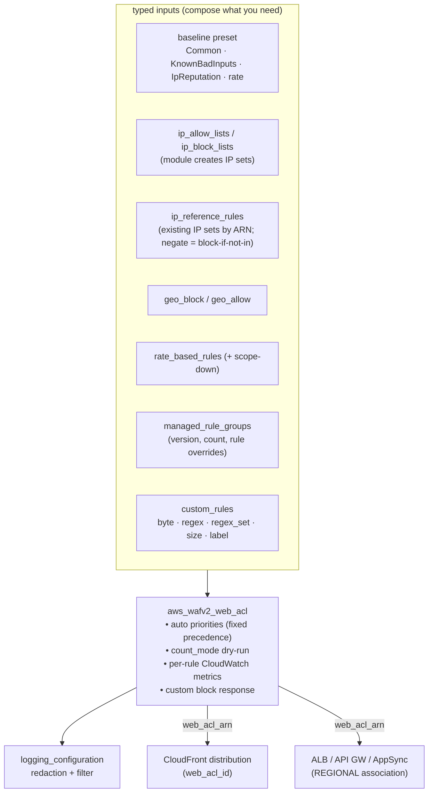

# wafv2

**A CloudFront (and regional) WAF where you compose protections and the module
handles the tedium — rule priorities, IP-set versions, count-mode onboarding,
and the arcane nested statement HCL.**

Built for AWS-experienced engineers: typed inputs per protection category, a
fixed and documented evaluation precedence with **auto-assigned priorities**
(you never hand-manage priority integers), a one-flag **best-practice baseline**,
and clean integration with CloudFront (`web_acl_id`) and the repo's `lb` module.

---

## Contents

- [Architecture](#architecture)
- [Quick start](#quick-start)
- [Rule precedence](#rule-precedence)
- [Recipes](#recipes)
- [Safe onboarding (count mode)](#safe-onboarding-count-mode)
- [Integration](#integration)
- [Requirements](#requirements)
- [Inputs](#inputs) · [Outputs](#outputs)
- [Testing](#testing)
- [Limitations & sharp edges](#limitations--sharp-edges)

---

## Architecture



## Quick start

```hcl
# CLOUDFRONT-scope WAF must live in us-east-1
provider "aws" {
  alias  = "use1"
  region = "us-east-1"
}

module "waf" {
  source    = "path/to/modules/wafv2"
  providers = { aws = aws.use1 }

  name  = "edge"
  scope = "CLOUDFRONT"
  # enable_baseline = true (default): Common + KnownBadInputs + IpReputation + 2000/5min rate
}

resource "aws_cloudfront_distribution" "site" {
  # ...
  web_acl_id = module.waf.web_acl_arn
}
```

## Rule precedence

Priorities are assigned automatically from a fixed, security-sound order — order
your lists, not integers:

```
ip_allow  <  ip_block  <  ip_reference  <  geo  <  rate  <  [custom phase=pre]  <  managed  <  [custom phase=post]
```

`custom_rules` default to `phase = "post"` (after managed groups). Set
`phase = "pre"` to place an allow-exception **before** managed groups — the
standard way to rescue legitimate traffic from a managed-rule false positive.
Inspect the assignment with the `rule_priorities` output.

## Recipes

### Managed groups with per-rule tuning

```hcl
managed_rule_groups = [
  { name = "AWSManagedRulesCommonRuleSet", version = "Version_1.0" }, # pin for change control
  { name = "AWSManagedRulesSQLiRuleSet" },
  {
    name = "AWSManagedRulesAnonymousIpList"
    rule_action_overrides = { HostingProviderIPList = "count" } # observe hosting-provider IPs
  },
]
```

### Rate limit a single path, on the real client IP

```hcl
rate_based_rules = [{
  name          = "login-brute-force"
  limit         = 100
  aggregate_key = "FORWARDED_IP"   # the viewer IP behind CloudFront
  scope_down    = { uri_path_contains = "/login" }
}]
```

### IP allow/block (module creates the sets) + external references

```hcl
ip_block_lists = { abuse = ["198.51.100.0/24"] }       # module creates the set

ip_reference_rules = [
  # block anything in a central threat-intel set maintained elsewhere
  { name = "threat-intel", arn = data.aws_wafv2_ip_set.threat.arn, action = "block" },
  # block anything NOT in the corporate proxy allowlist, matching the real
  # viewer IP from X-Forwarded-For (CloudFront) rather than the TCP source
  {
    name         = "proxy-only"
    arn          = data.aws_wafv2_ip_set.proxy.arn
    action       = "block"
    negate       = true
    forwarded_ip = { header_name = "X-Forwarded-For", position = "FIRST" }
  },
]
```

`ip_reference_rules` freedom: `action` (block\|count\|allow\|captcha\|challenge),
`negate` (block-if-not-in-set), and `forwarded_ip` to match the client IP from a
header (fallback_behavior MATCH\|NO_MATCH, position FIRST\|LAST\|ANY).

### Custom match rules

```hcl
custom_rules = [
  { name = "block-xmlrpc", field = "uri_path", type = "contains", value = "/xmlrpc.php" },
  { name = "oversize-body", field = "body", type = "size", size_operator = "GT", size = 8192, oversize_handling = "MATCH" },
  { name = "path-traversal", field = "uri_path", type = "regex_set", regex_patterns = ["(?i)\\.\\./"] },
  # act on a label emitted by Bot Control
  { name = "block-http-lib-bots", type = "label", value = "awswaf:managed:aws:bot-control:bot:category:http_library" },
]
```

## Safe onboarding (count mode)

`count_mode = true` forces **every** module-owned block action (IP block,
external IP refs, geo, rate, custom, and managed-group overrides) to Count.
Deploy it, watch the CloudWatch metrics and sampled requests / logs, confirm you
aren't blocking legitimate traffic, then set `count_mode = false` to enforce.
`baseline_count_only` does the same for just the baseline managed groups + rate.

> `count_mode` neutralizes **rule** block actions only; it cannot turn
> `default_action = block` into Count (WAF has no count default). Onboard a
> default-deny (allowlist) ACL with `default_action = allow` first, then flip it.

## Integration

- **CloudFront**: set `web_acl_id = module.waf.web_acl_arn` on the distribution
  (CloudFront references the ACL; there is no association resource).
- **Regional (ALB/API GW/AppSync/Cognito)**: use `scope = "REGIONAL"` and
  `associate_resource_arns`, **or** pass `web_acl_arn` to the repo `lb` module —
  not both (double association errors at apply).
- Outputs expose `web_acl_arn`/`id`/`name`, `web_acl_capacity` (WCU),
  `ip_set_allow_arns`/`ip_set_block_arns` (reuse elsewhere), and
  `rule_priorities` (audit evaluation order).

## Requirements

| Requirement | Detail |
|---|---|
| Terraform | `>= 1.9.0` (tested on 1.9.8 and current) |
| AWS provider | `>= 5.40.0, < 6.0.0` |
| CLOUDFRONT scope | provider **must** be us-east-1 (pass an aliased provider) |
| CloudWatch metrics | enabled per rule automatically (no extra config) |

## Inputs

### Core

| Name | Description | Type | Default |
|---|---|---|---|
| `create` | Master switch. | `bool` | `true` |
| `name` | Web ACL name (prefixes sets + metrics). | `string` | — |
| `description` | Web ACL description. | `string` | `"Managed by Terraform"` |
| `scope` | `CLOUDFRONT` (us-east-1) or `REGIONAL`. | `string` | `"CLOUDFRONT"` |
| `default_action` | `allow` (block bad traffic via rules) or `block` (allowlist model). | `string` | `"allow"` |
| `count_mode` | Force every module-owned block to Count (dry-run onboarding). | `bool` | `false` |
| `tags` | Tags on all resources. | `map(string)` | `{}` |

### Baseline

| Name | Description | Type | Default |
|---|---|---|---|
| `enable_baseline` | Common + KnownBadInputs + IpReputation + rate. | `bool` | `true` |
| `baseline_rate_limit` | Req/5-min/IP for the baseline rate rule (0 disables it). | `number` | `2000` |
| `baseline_count_only` | Baseline managed groups + rate in Count. | `bool` | `false` |

### Rules

| Name | Description | Type | Default |
|---|---|---|---|
| `managed_rule_groups` | AWS/vendor groups: `{name, vendor?, version?, count_only?, rule_action_overrides?}`. | `list(object)` | `[]` |
| `rate_based_rules` | `{name, limit, action?, aggregate_key?, evaluation_window?, scope_down?}`. | `list(object)` | `[]` |
| `ip_allow_lists` / `ip_block_lists` | Named CIDR lists (module creates single-version IP sets). | `map(list(string))` | `{}` |
| `ip_reference_rules` | Rules against existing IP sets by ARN: `{name, arn, action?, negate?, forwarded_ip?}` (negate = block-if-not-in; forwarded_ip matches the client IP from a header). | `list(object)` | `[]` |
| `ip_address_version_default` | Version for empty lists. | `string` | `"IPV4"` |
| `geo_block_countries` / `geo_allow_countries` | Block listed / block all-but-listed (mutually exclusive). | `list(string)` | `[]` |
| `custom_rules` | `{name, action?, phase?, field?, header_name?, type, value?, size*, regex_patterns?, text_transform?, oversize_handling?}`. types: contains\|starts_with\|ends_with\|exactly\|regex\|regex_set\|size\|label. | `list(object)` | `[]` |

### Responses / CAPTCHA / logging / association

| Name | Description | Type | Default |
|---|---|---|---|
| `custom_response_bodies` | Named block bodies `{content_type, content}`. | `map(object)` | `{}` |
| `block_response` | Default block response `{status_code, custom_response_body_key?, response_headers?}`; applied to **all** module block actions. | `object` | `null` |
| `token_domains` | Domains sharing CAPTCHA/Challenge/Bot tokens. | `list(string)` | `[]` |
| `captcha_immunity_seconds` / `challenge_immunity_seconds` | ACL-wide immunity times. | `number` | `null` |
| `enable_logging` | Enable WAF logging. | `bool` | `false` |
| `log_destination_arn` | CloudWatch (`aws-waf-logs-*`) / Firehose / S3 ARN. | `string` | `""` |
| `log_redacted_fields` | Fields to redact `{type, header_name?}`. | `list(object)` | `[]` |
| `log_filter` | `{default_behavior, filters[]}` to cut volume (e.g. keep only BLOCK). | `object` | `null` |
| `associate_resource_arns` | REGIONAL only: ALB/APIGW/etc. ARNs to attach. | `list(string)` | `[]` |

## Outputs

| Name | Description |
|---|---|
| `web_acl_arn` / `web_acl_id` / `web_acl_name` | The ACL (use `web_acl_arn` as CloudFront `web_acl_id`). |
| `web_acl_capacity` | Consumed WCU — watch against the 1500 default ceiling. |
| `ip_set_allow_arns` / `ip_set_block_arns` | Module-created IP set ARNs. |
| `rule_priorities` | id => auto-assigned priority (audit evaluation order). |
| `logging_enabled` | Whether logging is configured. |

## Testing

`terraform test` runs 29 plan/mocked-apply checks: baseline composition,
precedence/priority uniqueness, IP-version inference, managed overrides, all
custom-rule types, rate scope-down, external IP references (incl. negate),
count-mode (no block actions rendered), phase ordering, label match,
block-response consistency, logging, association, and a full negative-validation
set. Provider-schema fidelity was independently confirmed against aws v5.100.
A real `apply` in a sandbox is the final acceptance gate.

## Limitations & sharp edges

- **CLOUDFRONT scope ⇒ us-east-1.** Pass an aliased provider; the module can't
  change its own region.
- **IP allowlists short-circuit ALL later rules** (including managed groups) —
  an allowlisted CIDR bypasses every protection. Use narrowly; prefer
  `ip_reference_rules` with `action = "count"` if you only want visibility.
- **Custom rules are single-condition** (one field, one match, one transform).
  Arbitrary nested AND/OR/NOT isn't expressible in flat HCL — compose managed
  groups + several custom rules, or use `phase`/`label` for layering.
- **Body inspection cap:** CloudFront WAF inspects only the first ~8 KB of a
  body (16 KB max). A size-GT-cap check must set `oversize_handling = "MATCH"`.
- **Bot Control (TARGETED) and ATP** need `managed_rule_group_configs`, which is
  not wired — Bot Control runs at COMMON inspection level only.
- **Baseline groups can't pin a version** (turn baseline off and list them in
  `managed_rule_groups` to pin).
- **WCU ceiling is 1500** by default; a broad baseline + several groups can
  approach it. Watch `web_acl_capacity`.
- **Logging redaction is opt-in** — enable it (`log_redacted_fields`) before
  logging a sensitive app, or `Authorization`/`Cookie` land in the logs.
